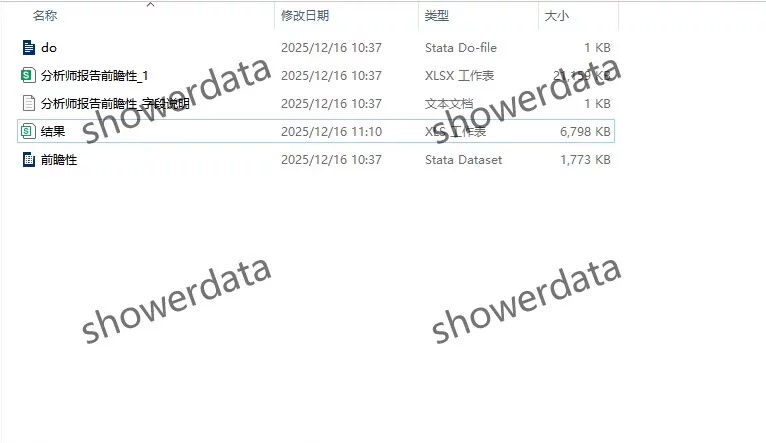
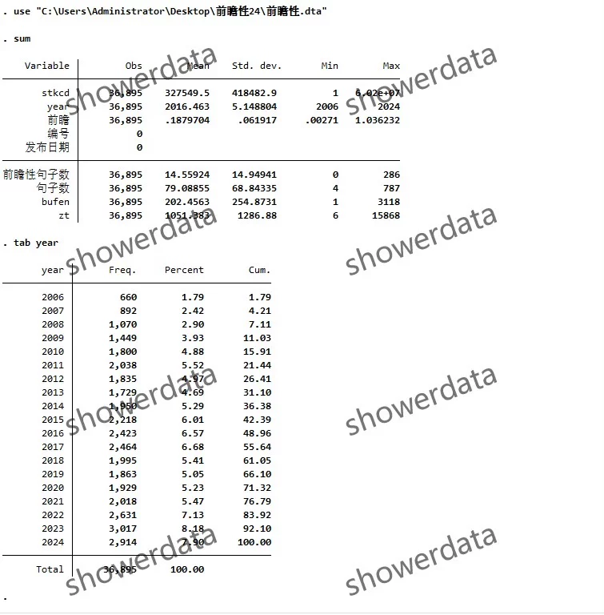
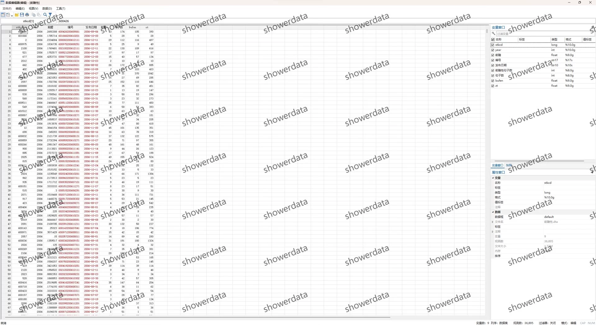
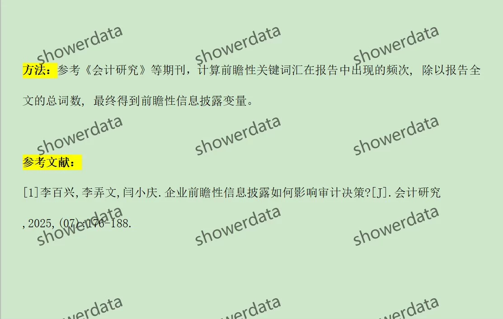

## Body

（2006-2024）A鼓尚视公司分析师报告前瞻性

一、数据介绍
Data Name: A鼓尚视公司分析师报告前瞻性
Sample Scope: A鼓尚视公司, 3.6w+ observations (displayed results without removing or truncation)
Time Range: 2006-2024
Data Formats: dta, excel
Data Content: Raw data, codes, results (one version, without removing or truncation)

二、Data Results Indicators as Shown in the Figure

三、Calculation Method as Shown in the Figure

四、References as Shown in the Figure

## Images

Here is a pay link on Stripe ( https://buy.stripe.com/3cs8yP7sY87d0vu9AB ). Please contact me lonlonago@foxmail.com after funding $89, and I will send you a complete data files , thank you!

